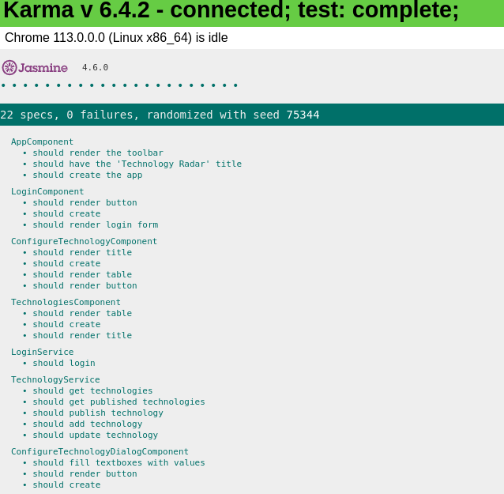
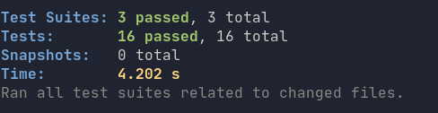

# Technology Radar

## Prerequisites

Install a postgresql database.
Make sure the following is fulfilled:
```
    user: 'admin',
    host: 'localhost',
    database: 'technologyradar',
    password: 'password',
    port: 5432,
```
Create a user `admin` with password `password`. Create a database called `technologyradar`. Now run the [SQL Schema](src/backend/database/schema.sql) to get the needed tables (History, Technology, Users) and their relations, with the needed users and some example technologies already filled in.

## Usage

Start the frontend while in the `src/frontend` directory:
```npm run ng serve```

Start the backend while in the `src/backend` directory:
```npm run dev```

On port 4200 you can now use the application. To log in, use one of the following users:
- cto@tech.com (role: cto)
- normal@tech.com (role: user -> no admin rights)
- tech-lead@tech.com (role: tech-lead)

Each of them uses password `secret`.

## Run tests

Run frontend tests with `nmp run ng test` while in the `src/frontend` directory:



Run backend tests with `nmp run test` while in the `src/backend` directory:


